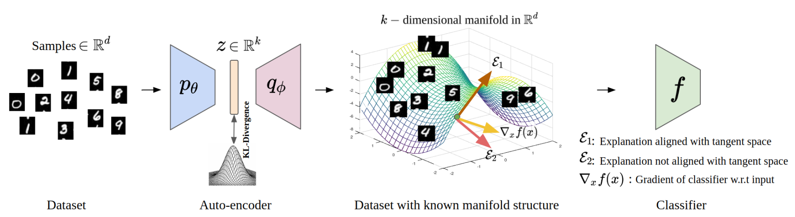

# The Manifold Hypothesis for Gradient-Based Explanations 

<p align="center">
  
</p>

[](https://opensource.org/licenses/MIT)

This is the code repository for the CVPR 2023 [Workshop Paper](http://bit.ly/43SwwbH) "The Manifold Hypothesis for Gradient-Based Explanations" by Sebastian Bordt, Uddeshya Upadhya, Zeynep Akata, and Ulrike von Luxburg. 

## Usage

Here we will soon provide some details on how to easily use our code and data!

## Replicating the results in our paper

The folder ```replicate-paper``` contains Python files and Jupyter Notebooks that we used to produce the results in our paper. 

- The folder ```replicate-paper/mnist``` contains the files for the MNIST32 and MNIST256 tasks.
- The folder ```replicate-paper/other_datasets``` contains the files for the CIFAR10, EMNIST, Pneumonia and Retinopathy.

## Citing our work

If you use this software in your research, we encourage you to cite our paper.

```bib
@inproceedings{bordt2023manifolds,
  author    = {Sebastian Bordt, Uddeshya Upadhya, Zeynep Akata, and Ulrike von Luxburg},
  title     = {The Manifold Hypothesis for Gradient-Based Explanations},
  booktitle = {Proceedings of the IEEE/CVF Conference on Computer Vision and Pattern Recognition (CVPR) Workshops},
  year      = {2023}
 }
```
